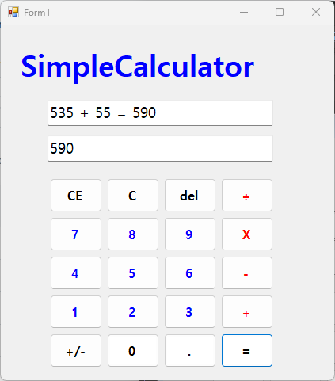
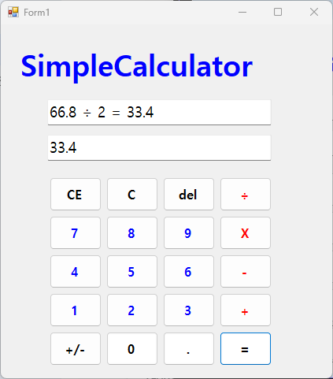
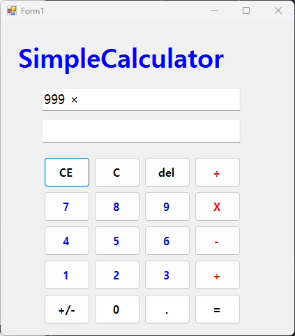
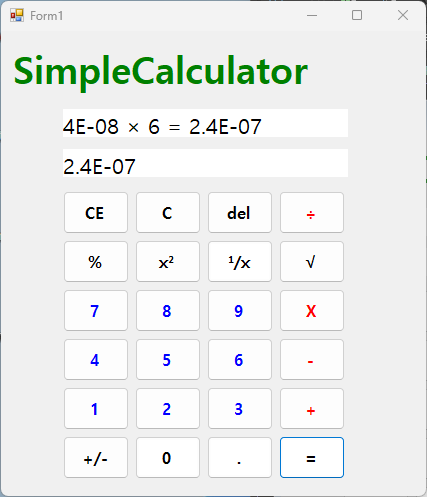

# (C# 코딩) 심플 사칙연산기

## 개요
- C# 프로그래밍 학습
- 1줄 소개: 버튼 및 키보드 입력을 실시간으로 처리하여 사칙연산과 고도화된 수식 제어 기능을 제공하는 Windows Forms 계산기 프로그램
- 사용한 플랫폼:
	- C#, .NET Windows Forms, Visual Studio, GitHub
- 사용한 컨트롤:
  - 텍스트 표시: TextBox (수식 기록용 TextBox_Input, 최종 결과 출력용 TextBox_Output)
  - 입력 버튼: 숫자 패드(0-9), 소수점(Dot), 부호 전환(PM)
  - 연산 및 제어: 사칙연산 4종(+, -, ×, ÷), 결과 확인(Result), 초기화 3종(C, CE, del), 특수 연산(Square, Sqrt, Reciprocal, Percent)
- 사용한 기술과 구현한 기능:
  - 컨트롤 명명 규칙: 기본 컨트롤 이름을 btnAdd, TextBox_Input 등으로 변경하여 유지보수성 향상
  - 데이터 형식 처리: string 데이터를 double 형식으로 변환하여 정밀한 실수 연산을 수행하고 결과를 다시 string으로 가공하여 출력
  - 이벤트 중심 설계: 버튼 클릭 및 키보드 입력을 개별/공통 메서드에 연결하여 사용자 반응형 UI 구현
  - KeyPreview 활성화: 폼 전체에서 키보드 입력을 가로채 마우스 없이도 모든 기능을 사용할 수 있도록 구현

---

## 실행 화면 (과제1)
- 과제1 코드의 실행 스크린샷

- 과제 내용
  - 계산기 레이아웃 설계 및 기초 컨트롤 배치
  - 숫자 버튼 클릭 시 텍스트박스에 숫자가 누적되는 입력 시스템
  - 데이터 형 변환(Parse 및 ToString)을 활용한 더하기(+) 기능 완성

- 구현 내용과 기능 설명
  - 숫자 버튼 클릭 시 현재 입력창의 문자열 뒤에 해당 숫자를 이어 붙이는 로직을 구현했습니다.
  - 연산자 버튼 클릭 시 현재 값을 저장하고 입력창을 초기화하여 다음 피연산자를 받을 준비를 하도록 설계했습니다.
  - 결과 보기 버튼 클릭 시 저장된 값과 현재 값을 합산하여 메인 출력창에 표시하는 기초 연산 흐름을 확립했습니다.

---

## 실행 화면 (과제2)
- 과제2 코드의 실행 스크린샷

- 과제 내용
  - 뺄셈(-), 곱셈(×), 나눗셈(÷) 기능을 추가하여 사칙연산 엔진 통합
  - 모든 연산 버튼이 공통 로직을 공유하도록 이벤트 연결 및 구조 설계
  - 연산자 클릭 시 현재 상태를 갱신하고 데이터를 안전하게 보관하는 시스템 구축

- 구현 내용과 기능 설명
  - 단일 연산자 변수를 활용하여 현재 선택된 연산이 무엇인지 기억하고, 결과 출력 시 조건문에 따라 연산을 분기 처리했습니다.
  - 곱셈과 나눗셈 기호를 사용자에게 친숙한 기호(×, ÷)로 출력하되, 내부 연산에서는 표준 연산자로 변환하여 처리하는 로직을 적용했습니다.
  - 단순 계산을 넘어 연산자 기호가 화면에 실시간으로 반영되도록 하여 사용자의 가독성을 높였습니다.

---

## 실행 화면 (과제3)
- 과제3 코드의 실행 스크린샷

- 과제 내용
  - 수정 및 초기화를 위한 C, CE, del 버튼 기능 구현
  - 완전 초기화와 부분 삭제의 논리적 차별화
  - 문자열 조작을 통한 단일 문자 삭제(Backspace) 로직 적용

- 구현 내용과 기능 설명
  - C (Clear): 모든 변수와 텍스트 박스를 비우고 프로그램의 모든 상태를 최초 실행 시점으로 되돌립니다.
  - CE (Clear Entry): 현재 입력 중인 마지막 피연산자만 삭제하여 긴 수식 입력 중 오타를 수정할 수 있게 했습니다.
  - del (Delete): 문자열의 Substring 메서드를 활용하여 가장 오른쪽 글자 하나만 지우는 기능을 구현했으며, 공백을 포함한 연산자 세트를 한 번에 지우는 예외 처리를 추가했습니다.

---

## 실행 화면 (과제4)
- 과제4 코드의 실행 스크린샷

- 과제 내용
  - 윈도우 계산기 수준의 특수 수식(제곱, 제곱근, 역수, 퍼센트) 도입
  - 부호 전환(+/-) 및 소수점(.) 중복 방지 로직 고도화
  - 다중 연산 처리 및 키보드 입력 지원 (지능형 입력 시스템)

- 구현 내용과 기능 설명
  - Math 클래스를 활용해 제곱(x^2), 제곱근(sqrt) 등 정밀한 공학 연산 기능을 보강했습니다.
  - DataTable.Compute 방식을 도입하여 연산자 우선순위가 포함된 다중 혼합 연산(예: 10 + 20 * 3)이 정확히 계산되도록 개선했습니다.
  - KeyPreview 속성을 True로 설정하고 KeyDown 이벤트를 연결하여 숫자키, 사칙연산키, Enter, Esc, Backspace 등의 키보드 조작을 완벽 지원합니다.
  - 상단 텍스트박스에는 전체 수식 과정을, 하단에는 현재 입력값 및 최종 결과만 표시하는 2단 출력 구조를 완성했습니다.
  - 0으로 나누기 등 수학적 오류 상황에 대해 예외 처리를 적용하여 프로그램의 안정성을 확보했습니다.